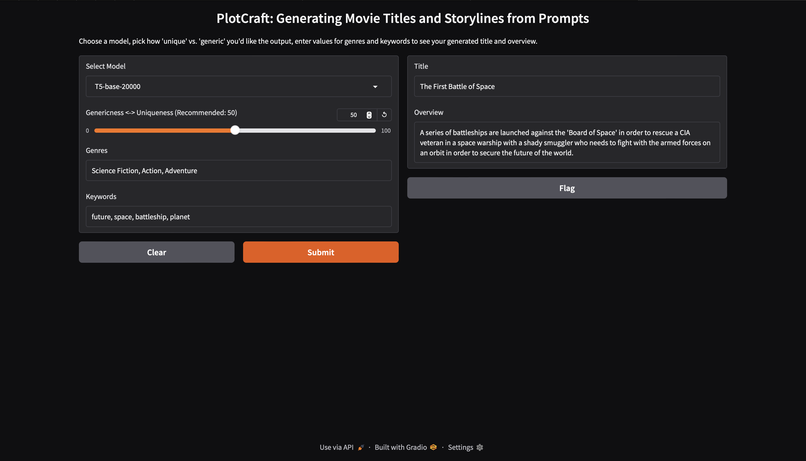

# PlotCraft: Generating Movie Titles and Storylines from Prompts 

In this project, we fine-tuned Google's T5 LLM models to generate movie titles and plots based on user inputted list of genres, keywords, and uniqueness scale.



A brief explanation of our project is linked here: https://docs.google.com/presentation/d/1RL3CpS6M5iGCNIxN3pANu_b86eMyvvdJF246kzFfo8Q/edit#slide=id.g349101410f4_0_0

Try out the models for yourself!!!

Steps:

1. Download models here: https://drive.google.com/drive/folders/1mQkDWQjsmSTzof_ipwhESY9U2EXq7UwI?usp=drive_link

2. Download movie-generator-app.py, requirements.txt

3. Download necessary packages: 

```
pip install -r requirements.txt
```

4. Run:

```
python movie-generator-app.py
```

5. Copy either the private link or public link to your browser and try it out!!
